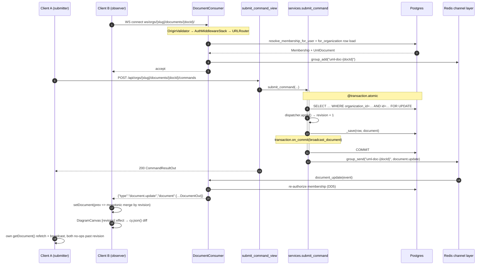

# Design: Real-time UML Collaboration

## Technical Approach

Result-broadcast (proposal §Approach). `dispatcher.apply()` is untouched and
HTTP POST stays the only write transport; the WebSocket is read-only fan-out.
Three seams change: `submit_command` becomes a locked, atomic unit that emits
one `transaction.on_commit` broadcast; a new sync `DocumentConsumer` joins a
per-document group behind the *read* authorization gate; `useDocument` gains a
socket whose only effect is `setDocument` under a monotonic-revision merge.
The serialized payload is the **existing** `DocumentOut`, so a broadcast and a
`GET .../documents/{docId}` are byte-identical — the client needs no new
decoding path.

## Decision Drivers

- `UmlDocument.objects` is a `TenantScopedManager` whose `get_queryset()`
  **raises** `TenantScopeViolation` (`organizations/models.py:49-54`). An
  unscoped locked read is impossible by construction, not by convention.
- `submit_command` (`uml_documents/services.py:91-98`) has **no** transaction
  today, so `select_for_update()` must arrive paired with a new `atomic` scope.
- `_get_row` (`services.py:56-60`) is shared with `get_document`, which is
  called from a **non**-transactional GET view — an unconditional
  `select_for_update()` there raises `TransactionManagementError`.
- The document **read** path carries no role gate:
  `get_document_view` calls only `resolve_membership`, with an explicit
  `# no require_role — DD3, any member reads` at `api.py:54`.
- `DiagramCanvas`'s update effect is keyed on `[revision]` alone
  (`DiagramCanvas.tsx:347`); `model` is a deliberate non-dep (prior cycle DD4).
- `cy.json({elements})` diffs and **preserves existing node positions**
  (`DiagramCanvas.tsx:296-298`); the only position-moving call is
  `cy.layout(...).run()`, gated on `newClassIds.length > 0` (line 321).
- `pendingSourceId`/`pendingTargetId` are `useState` **inside `DocumentPage`**
  (`page.tsx:35-36`); `useDocument` has no reference to them.
- `settings.py` builds every connection from discrete env vars defaulting to
  the Compose **service name**, never `localhost` (its docstring, `DATABASES`).

## Architecture Decisions

| # | Decision | Alternatives rejected | Rationale |
|---|---|---|---|
| DD1 | `@transaction.atomic` on `submit_command`; `_get_row` gains a **`for_update: bool = False`** flag that conditionally chains `.select_for_update()` **after** `.for_organization(...)` | Lock unconditionally inside `_get_row`; open an explicit `with transaction.atomic():` block inside the body | The flag exists because `_get_row` also backs `get_document`, whose GET view runs outside any transaction — an unconditional lock raises `TransactionManagementError` on the read path. The decorator (not a `with` block) matches the project's established shape at `users/services.py:40` and `organizations/services.py:68/118/134`. **Tenant scoping is preserved**: `.for_organization(org)` applies `WHERE organization_id = %s` *before* `select_for_update()` appends `FOR UPDATE`, so the lock is taken on the already-scoped row; `select_for_update()` never widens a queryset. `Http404` raised inside the atomic block simply rolls back a transaction that wrote nothing |
| DD2 | Broadcast via `transaction.on_commit(lambda: broadcast_document(...))`, placed after `_save(...)`, closing over `result.document` | Broadcast inline after `_save`; a `post_save` signal on `UmlDocument` | Copies `users/services.py:73` verbatim in style (module-level function, keyword args, lambda closure). Inline would publish a revision readers cannot yet `SELECT`, which is exactly proposal §Risks' stale-row row. Closing over the in-memory `ProjectDocument` — not `row` — means the callback performs **zero** queries after commit. A `post_save` signal would also fire for `create_document`, which has no group to talk to |
| DD3 | New sync `DocumentConsumer(JsonWebsocketConsumer)` in `uml_documents/consumers.py`, routed by a new `uml_documents/routing.py` at `ws/orgs/<org_slug>/documents/<doc_id>/`. Group name **`f"uml-doc-{doc_id}"`** | `AsyncJsonWebsocketConsumer`; group per `org:doc`; group per org | Every line of this codebase is sync ORM; a sync consumer runs in Channels' thread pool and can call membership/document queries **directly**, with no `database_sync_to_async` wrapper and no async fork of `resolve_membership`. The group key is the document UUID alone because a UUID is already globally unique and **authorization, not the group name, enforces tenancy** (DD4) — adding the slug would imply the name is a security boundary, which it is not. An org-wide group would fan a document's traffic out to clients that never opened it. The path mirrors the HTTP route `/api/orgs/{slug}/documents/{docId}` so the two stay legible together |
| DD4 | `connect()` authorizes with **membership only — no `require_role`** — via a new `resolve_membership_for_user(user, org_slug)` extracted from `resolve_membership`, then loads the row through `for_organization(membership.organization)`. Close codes: `4401` unauthenticated, `4404` unknown-org / non-member / unknown-doc | Mirror the *write* gate (`require_role(OWNER, EDITOR)`) as proposal §Scope words it; duplicate the membership query inside the consumer | **Correction to the proposal's wording, with evidence**: the WS is a read subscription, and the read endpoint it mirrors (`get_document_view`) deliberately has no role gate (`api.py:54`). Requiring OWNER/EDITOR would lock a `VIEWER` out of live updates for a document they can already `GET`. Extracting the user-level function keeps `permissions.py`'s stated invariant ("Nothing else in the app decides authorization") true — `resolve_membership(request, org_slug)` becomes a one-line delegate and its 20 HTTP callers stay byte-identical. One close code for all three miss cases preserves `resolve_membership`'s documented "404 for unknown slug AND non-member — indistinguishable by design" contract over the WS transport |
| DD5 | Re-run the same authorization in the group-message handler before relaying; on failure `close(4403)`. Document deletion is **not** separately handled | Periodic re-validation timer; validate only at `connect()`; a revocation signal pushed onto the group | A revoked member must stop receiving data at the exact moment data would leak, and that moment *is* the outbound message — one indexed `Membership` lookup per delivered broadcast, in a thread-pool consumer, for a tool with a handful of concurrent editors. A timer adds machinery and still leaks for up to one interval. Deletion needs nothing: broadcasts only originate from `submit_command`, which cannot run against a deleted row, so a deleted document simply produces no further messages and the client's next `getDocument()` 404s through `useDocument`'s existing `notFound` branch (`document.ts:72`) |
| DD6 | Broadcast payload is the **existing** `DocumentOut`: promote `api._document_out` to `codec.document_out(document)`, and the consumer sends `DocumentOut.model_validate(codec.document_out(doc)).model_dump(mode="json")` | Invent a smaller diff payload; import `api._document_out` into `services.py`; hand-roll a second serializer | Reusing the GET shape means the client merge is `setDocument(incoming)` with **zero** new decoding, and any future `DocumentOut` field reaches both transports at once — a diff format would be a second, drift-prone contract for no measured benefit at this document size. `codec` is the natural home because `_document_out` is nothing but `_encode_model` + `_encode_layout` composed, and it removes `api.py`'s reach into two underscore-private `codec` functions. `services → api` would invert the layering (`api` depends on `services`). `model_dump(mode="json")` is load-bearing: the raw dict holds `UUID`/`datetime` objects that `json.dumps` rejects, and routing it through the same Pydantic schema is what *guarantees* byte-identity with the GET |
| DD7 | Client envelope `{"type": "document.update", "document": {…DocumentOut}}`; the `group_send` payload uses the same `"type": "document.update"`, dispatching to handler `document_update` | A bare document object; separate internal/external type names | Channels routes a group message by its `type` key with dots mapped to underscores, so one spelling serves both the dispatch and the wire envelope. An outer `type` leaves room for a later `document.deleted` without a breaking change; a bare object would not |
| DD8 | `CHANNEL_LAYERS` → `channels_redis.core.RedisChannelLayer` built from **discrete** `REDIS_HOST`/`REDIS_PORT` env vars defaulting to `("redis", 6379)`; new `redis:7-alpine` Compose service with a `redis-cli ping` healthcheck and `depends_on: condition: service_healthy` on `backend`; `channels-redis>=4.2,<5.0` in `requirements/base.txt` | A single `REDIS_URL`; `InMemoryChannelLayer` | Discrete host/port defaulting to the Compose service name is exactly the `DATABASES` pattern (`settings.py:97-107`) and the file's stated "never a `localhost` fallback" rule; a `REDIS_URL` would introduce a second, inconsistent connection-string convention. In-memory was rejected in exploration: prod already runs `daphne`, which scales to multiple processes, and an in-memory layer fails **silently** there. The healthcheck mirrors `db`'s so the backend never boots into a `ConnectionError` on first `group_add` |
| DD9 | `OriginValidator(AuthMiddlewareStack(URLRouter(...)), settings.CORS_ALLOWED_ORIGINS)` in `asgi.py`, `OriginValidator` **outermost**. No CSRF equivalent, no new env var | A dedicated `WS_ALLOWED_ORIGINS` var; token-in-query-string auth; `AllowedHostsOriginValidator` | `CORS_ALLOWED_ORIGINS` (`settings.py:143`) already holds exactly `scheme://host[:port]` strings for the frontend in every environment, which is `OriginValidator`'s input format — reusing it makes HTTP and WS origin policy structurally incapable of drifting. `OriginValidator` outermost rejects a foreign origin before a session lookup is ever attempted. CSRF genuinely does not apply: a browser `new WebSocket()` cannot set the `X-CSRFToken` header `lib/api.ts:12` echoes, and it need not — the socket performs **no writes**, so the forced-state-change threat CSRF defends against has no target here. Session delivery needs no new setting: `SESSION_COOKIE_SAMESITE` (`settings.py:153`) already governs whether the cookie rides the handshake. A query-string token would put a credential in server logs |
| DD10 | **Dev serves WebSocket under `manage.py runserver` today — no Dockerfile or entrypoint change.** (Full derivation below) | Switch the dev `CMD` to `daphne`; keep it as an open spike | Resolved from Django's documented command resolution plus this repo's actual `INSTALLED_APPS` order; see §Dev-Server WebSocket Capability. Switching to `daphne` would forfeit autoreload for a problem that does not exist |
| DD11 | The WS client lives **inside `useDocument`** (`state/document.ts`) as a second effect keyed `[orgSlug, docId]`; merge is `setDocument(prev => incoming.revision <= prev.revision ? prev : incoming)` | A standalone `useDocumentSocket` hook; a Jotai atom; merging in `DiagramCanvas` | `useDocument` already owns `document`, already resets on the `${orgSlug}:${docId}` tracked key (`document.ts:48-57`), and is the sole producer of the `revision` prop `DiagramCanvas` is keyed on. A sibling hook would duplicate that key logic and then have to push into `useDocument`'s state anyway. The monotonic guard matters because the submitter receives **both** its own `getDocument()` refetch (`document.ts:117`) and the broadcast: without it an out-of-order delivery regresses `revision` and re-runs the canvas effect against older data. Returning `prev` **by identity** also makes React bail out of the re-render entirely, so a duplicate costs zero `cy.json()` calls |
| DD12 | **No guard is added for `pendingSourceId`/`pendingTargetId` — a remote update structurally cannot touch them.** A drag guard **is** added: `draggingRef` + `pendingUpdateRef` in `DiagramCanvas`, flushed on `free` | Lift pending ids into `useDocument`; freeze merges while a gesture is pending; pause the socket during a drag | Verified at `page.tsx:35-36`: both ids are `useState` local to `DocumentPage`, and `useDocument` never receives a setter for them — `setDocument` cannot write another hook's state, so the click-click gesture survives by construction and needs no mechanism. The one *intended* interaction is `effectiveSourceId` collapsing to `null` when the remote update removed the pinned class (`page.tsx:67-73`) — that comment already declares this the correct behavior for the local-refetch case, and a remote removal is the same event. The drag is different and real: a remote **class addition** makes `newClassIds.length > 0`, firing `cy.layout(...).run()` (line 329) mid-grab. `fixedNodeConstraint` pins already-placed nodes, so the dragged node cannot teleport, but the layout still runs under the user's cursor — deferring the whole sync to the `free` event is cheaper and more predictable than reasoning about fcose mid-gesture. Stashing `model` in a ref is consistent with `model` already being a deliberate non-dep of that effect |
| DD13 | On close: reconnect with capped backoff (1s→2s→4s→8s→10s), and **every** successful `open` — including the first — calls `getDocumentApi(orgSlug, docId)` once through the same monotonic merge. Close codes `4401`/`4403`/`4404` are **terminal** (no reconnect) | Replay missed commands; refetch only on re-connect, not first connect; reconnect on every close code | One `getDocument()` on open collapses every missed broadcast into a single request and is literally the call `submitCommand` already makes at `document.ts:117` — this is proposal §Out of Scope's "reconnect-and-refetch", nothing more. Refetching on the *first* open too removes a branch and costs nothing: the monotonic merge bails out on an equal revision. Reconnecting after `4401`/`4403`/`4404` would make an unauthenticated or just-revoked client hammer the handshake forever |

## Dev-Server WebSocket Capability (resolves proposal §Risks row 1)

**Resolution: `python manage.py runserver` already serves WebSocket in the dev
container. No `backend/Dockerfile` or `entrypoint.sh` change is in scope.**

1. Django's `get_commands()` iterates `reversed(apps.get_app_configs())` and
   applies `commands.update(...)`, so an app listed **earlier** in
   `INSTALLED_APPS` overrides a later app's same-named management command.
2. `daphne` sits at `INSTALLED_APPS` index 5 and `django.contrib.staticfiles`
   at index 6 (`settings.py:41-42`). Daphne is earlier, so
   `daphne.management.commands.runserver` wins over the staticfiles one. This
   *is* the reason for the existing `# daphne must be listed before
   django.contrib.staticfiles per Channels docs` comment at `settings.py:40` —
   the ordering requirement already in this repo exists precisely to make
   `runserver` ASGI-capable.
3. `ASGI_APPLICATION = "config.asgi.application"` is already set
   (`settings.py:90`), so Daphne's runserver serves the `ProtocolTypeRouter`
   including its `"websocket"` branch. Autoreload and DEBUG static serving are
   retained by that command.

**Acceptance readback (one line, deterministic — not a spike):** the dev
container's startup banner must read
`Starting ASGI/Daphne version … development server at http://0.0.0.0:8000/`
rather than Django's `Starting development server at …`.

Two facts that must not be misread as counter-evidence: the `"websocket"`
router is empty **today**, so any current connect attempt fails with a
Channels "no route found" error; and `group_add` raises `ConnectionError`
until Redis is up. Neither indicates a missing ASGI server. Consequently
`sdd-tasks` sequences Redis + `CHANNEL_LAYERS` + routing **before** the
consumer, and schedules **no** Dockerfile work. Contingency if the banner
disagrees: change the dev `CMD` to `daphne -b 0.0.0.0 -p 8000
config.asgi:application` — accepted only as a fallback, since it costs
autoreload.

## Sequence Diagram (config.yaml `rules.design`)



## Interfaces / Contracts

```python
# services.py — BEFORE (91-98)              # AFTER
def submit_command(*, organization,         @transaction.atomic
        doc_id, command, now):              def submit_command(*, organization,
    row = _get_row(                                 doc_id, command, now):
        organization=organization,              row = _get_row(
        doc_id=doc_id)                              organization=organization,
    document = _to_project_document(row)            doc_id=doc_id,
    result = apply(document, command,               for_update=True)   # DD1
                   now=now)                    document = _to_project_document(row)
    _save(row, result.document)               result = apply(document, command,
    return result                                            now=now)
                                              _save(row, result.document)
                                              transaction.on_commit(      # DD2
                                                  lambda: broadcast_document(
                                                      document=result.document))
                                              return result
```

```python
# services.py — _get_row (56-60), tenant scope applied BEFORE the lock (DD1)
def _get_row(*, organization: Organization, doc_id: UUID, for_update: bool = False) -> UmlDocument:
    qs = UmlDocument.objects.for_organization(organization)   # WHERE organization_id = …
    if for_update:
        qs = qs.select_for_update()                           # … FOR UPDATE
    try:
        return qs.get(id=doc_id)
    except UmlDocument.DoesNotExist as exc:
        raise Http404("Document not found") from exc
```

```python
# settings.py — new block, mirroring DATABASES' discrete-env-var shape (DD8)
REDIS_HOST = env("REDIS_HOST", default="redis")   # Compose service name, never localhost
REDIS_PORT = env.int("REDIS_PORT", default=6379)

CHANNEL_LAYERS = {
    "default": {
        "BACKEND": "channels_redis.core.RedisChannelLayer",
        "CONFIG": {"hosts": [(REDIS_HOST, REDIS_PORT)]},
    }
}
```

```python
# asgi.py — the empty URLRouter([]) at line 28 is replaced (DD9).
# routing/consumers are imported AFTER get_asgi_application() (line 23),
# per this file's own docblock constraint.
application = ProtocolTypeRouter({
    "http": django_asgi_app,
    "websocket": OriginValidator(
        AuthMiddlewareStack(URLRouter(websocket_urlpatterns)),
        settings.CORS_ALLOWED_ORIGINS,          # reused, not duplicated
    ),
})
```

```ts
// state/document.ts — merge, inside useDocument (DD11)
function mergeRemote(incoming: UmlDocument) {
  setDocument((prev) =>
    prev !== null && incoming.revision <= prev.revision ? prev : incoming,
  );
}
// Returning `prev` by identity makes React bail out — no canvas re-sync.
```

```ts
// lib/env.ts — derived, no new env var (config.yaml "never hardcode URLs")
export const wsUrl = apiUrl.replace(/^http/, "ws");
```

Wire envelope (identical to `GET /api/orgs/{slug}/documents/{docId}`):

```json
{ "type": "document.update", "document": { "id": "…", "owner_id": "…", "revision": 7,
  "metadata": {…}, "model": {…}, "layout": {…}, "created_at": "…", "updated_at": "…" } }
```

## File Changes

| File | Action | Description |
|---|---|---|
| `backend/apps/uml_documents/consumers.py` | Create | `DocumentConsumer` — connect authz (DD4), group join (DD3), `document_update` handler with re-authorization (DD5) |
| `backend/apps/uml_documents/routing.py` | Create | `websocket_urlpatterns` for `ws/orgs/<org_slug>/documents/<doc_id>/` |
| `backend/apps/uml_documents/services.py` | Modify | `@transaction.atomic` + `for_update` flag (DD1); `on_commit` broadcast + `broadcast_document` (DD2/DD7) |
| `backend/apps/uml_documents/codec.py` | Modify | Add `document_out(document) -> dict`, promoted from `api._document_out` (DD6) |
| `backend/apps/uml_documents/api.py` | Modify | `_document_out` delegates to `codec.document_out`; drops the two `codec._`-private calls |
| `backend/apps/organizations/permissions.py` | Modify | Extract `resolve_membership_for_user(user, org_slug)`; `resolve_membership` becomes a one-line delegate (DD4) — 20 HTTP callers unchanged |
| `backend/config/asgi.py` | Modify | Replace `URLRouter([])` with `OriginValidator(AuthMiddlewareStack(...))` (DD9); update the docblock |
| `backend/config/settings.py` | Modify | `REDIS_HOST`/`REDIS_PORT` + `CHANNEL_LAYERS` (DD8) |
| `backend/requirements/base.txt` | Modify | `channels-redis>=4.2,<5.0` |
| `backend/env.example` | Modify | `REDIS_HOST`/`REDIS_PORT` |
| `docker-compose.yml` | Modify | `redis:7-alpine` service + healthcheck; `backend.depends_on` gains it (DD8) |
| `backend/Dockerfile`, `backend/entrypoint.sh` | **None** | Zero diff — DD10 |
| `frontend/src/lib/env.ts` | Modify | `wsUrl` derived from `apiUrl` |
| `frontend/src/lib/uml_documents.ts` | Modify | `openDocumentSocket(orgSlug, docId, handlers)` transport seam — the only place that builds a WS URL |
| `frontend/src/state/document.ts` | Modify | Socket effect, monotonic merge, reconnect + refetch (DD11/DD13) |
| `frontend/src/components/workspace/DiagramCanvas.tsx` | Modify | `draggingRef`/`pendingUpdateRef`, `grab`/`free` handlers, deferred sync (DD12) |
| `frontend/src/app/(app)/documents/[docId]/page.tsx` | **None** | Zero diff — DD12: pending ids are unreachable from `useDocument` |
| `docs/ai/DECISIONS_LOG.md`, `docs/ai/CURRENT_STATE.md` | Modify | `config.yaml` `rules.design` dual documentation |

## Testing Strategy

| Layer | Case |
|---|---|
| Unit (pytest) | `_get_row(for_update=True)` outside a transaction raises `TransactionManagementError`; inside `submit_command` it does not |
| Unit | `_get_row(for_update=True)` for org B's `doc_id` still raises `Http404` — the lock does not bypass `for_organization` (DD1) |
| Unit | `codec.document_out(doc)` validated by `DocumentOut` equals the `GET` body byte-for-byte (DD6) |
| Unit | `resolve_membership(request, slug)` and `resolve_membership_for_user(request.user, slug)` return the same row and raise `Http404` identically (DD4) |
| Integration (`transaction=True`) | Two concurrent `submit_command` calls on one document both persist; `revision` ends at `n + 2`, no lost update |
| Integration (`django_capture_on_commit_callbacks`) | The broadcast fires **once**, **after** commit, and not at all when `apply()` raises. **Gotcha for `sdd-tasks`**: `on_commit` never runs under the default `pytest.mark.django_db` wrapper |
| Integration (`ChannelsLiveServerTestCase`/`WebsocketCommunicator`) | Authenticated `VIEWER` connects and receives (DD4); anonymous → `4401`; non-member → `4404`; member of org A on org B's `doc_id` → `4404` |
| Integration | Membership deleted after connect → next broadcast closes with `4403` and delivers no payload (DD5) |
| Integration | A foreign `Origin` header is rejected at the handshake (DD9) |
| Integration | End-to-end: A's POST reaches B's socket as `{"type":"document.update","document":…}` with `revision` incremented once |
| Unit (Vitest) | `mergeRemote`: lower/equal revision returns the **same object identity**; higher replaces (DD11) |
| Unit (Vitest) | Socket `open` triggers exactly one `getDocument()`; `4401`/`4403`/`4404` schedule **no** reconnect; `1006` does, with capped backoff |
| Unit (Vitest) | Unmount closes the socket and clears the pending reconnect timer |
| Component (RTL) | `DiagramCanvas`: a revision bump while `draggingRef` is set performs no `cy.json()`; the `free` event flushes exactly one sync (DD12) |
| Component (RTL) | `DocumentPage`: a remote update does **not** clear `pendingSourceId`/`pendingTargetId`; removing the pinned class remotely collapses `effectiveSourceId` to `null` (DD12) |
| E2E | Deferred — no Cypress harness (`config.yaml` `testing.e2e`) |

## Threat Matrix

N/A — this change adds no shell command, subprocess, VCS/PR automation,
executable-file classification, or process-integration boundary, and every row
of `references/threat-matrix.md` addresses git/PR/command composition. The
adversarial surface that *does* exist here is the WS handshake authorization
boundary (DD4/DD5/DD9), covered by the four dedicated Integration rows above
rather than by an inapplicable matrix.

## Migration / Rollout

No database migration — `UmlDocument` is untouched. Redis is purely additive:
until `CHANNEL_LAYERS` exists, nothing calls `get_channel_layer()`. The
`@transaction.atomic` + `select_for_update` hardening (DD1) is independently
revertable and worth keeping on its own merit, since it closes a lost-update
race that predates this feature. Rollback is `git revert` per proposal
§Rollback Plan: with `asgi.py`'s router empty again the frontend socket simply
fails to open, `useDocument` falls back to fetch-on-mount, and DD13's terminal
close-code handling stops it from retrying in a loop.

## Open Questions

- [ ] DD5 costs one `Membership` query per delivered broadcast per connection.
      Correct and cheap at this project's scale; if a document ever carries
      many simultaneous viewers, cache the membership in `scope` with a short
      TTL rather than dropping the check.
- [ ] DD13's backoff ceiling (10s) and step are chosen, not measured. Worth one
      pass during apply against a real container restart.
